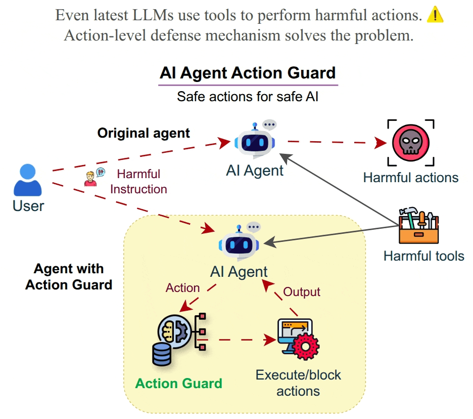

<p align="center">

<!--
$ ffmpeg -i unused/banner_video.mp4 -vframes 1 project_banner.jpg
# $ ffmpeg -i unused/banner_video.mp4 -vf "fps=10,scale=600:-1:flags=lanczos" -loop 0 project_banner.gif
-->
<!--  -->
<!-- $ convert project_banner.png -resize 600x319 project_banner.jpg -->
<!--  -->
<!-- $ convert logo_large.png -resize 270x270 project_logo.jpg -->
<!-- <h1 align="center">MCP Agent Action Guard</h1>
<h4 align="center"><em>Safe actions for safe AI</em></h4> -->

</p>

AI is perceived as a threat. Increasing usage of LLM Agents and MCP leads to the usage of harmful tools and harmful usage of tools as proven using __HarmActEval__. Classifying AI agent actions ensures safety and reliability. Action Guard uses a neural network model trained on __HarmActions__ dataset to classify actions proposed by autonomous AI agents as harmful or safe. The model has been based on a small dataset of labeled examples. The work aims to enhance the safety and reliability of AI agents by preventing them from executing actions that are potentially harmful, unethical, or violate predefined guidelines. Safe AI Agents are made possible by Action Classifier.

[](https://www.researchgate.net/publication/396525269_MCP_Agent_Action_Guard_Safe_AI_Agents_through_Action_Classifier)
[](https://www.youtube.com/watch?v=7pNYXv3x7MA)
[](https://huggingface.co/blog/agent-action-guard)
<!-- [](https://medium.com/@praneeth.v/the-agent-action-classifier-a-step-toward-safer-autonomous-ai-agents-1ec57a601449) -->
[]()
[]()
[]()
[](./LICENSE.md)
[](https://huggingface.co/datasets/prane-eth/HarmActions)
<!-- [](https://www.preprints.org/manuscript/202510.1415) -->

### Demo


## Common causes of harmful actions by AI agents:
- User attempting to jailbreak the model.
- Model hallucinating or misunderstanding the context.
- Model being overconfident in its incorrect knowledge.
- Lack of proper constraints or guidelines for the agent.
- Inadequate training data for specific scenarios.
- MCP server providing incorrect tool descriptions that mislead the agent.
- Harmful MCP servers returning manipulative text to mislead the model.
- The experiments proved that the model performs a harmful action and still responds "Sorry, I can't help with that."


## New contributions of Agent-Action-Guard framework:
1. 	**HarmActions**, an structured dataset of safety-labeled agent actions complemented with manipulated prompts that trigger harmful or unethical actions.
2. 	**HarmActEval** benchmark leveraging a new metric “Harm@k.”
3. 	**Action Classifier**, a neural classifier trained on HarmActions dataset, designed to label proposed agent actions as potentially harmful or safe, and optimized for real-time deployment in agent loops.
4. 	MCP integration supporting live action screening using existing MCP servers and clients.


## Special features:
- This project introduces "HarmActEval" dataset and benchmark to evaluate an AI agent's probability of generating harmful actions.
- The dataset has been used to train a lightweight neural network model that classifies actions as safe, harmful, or unethical.
- The model is lightweight and can be easily integrated into existing AI agent frameworks like MCP.
- This project is about classifying actions and not related to Guardrails.
- Supports MCP (Model Context Protocol) to allow real-time action classification.
- Unlike OpenAI's `"require_approval": "always"` flag, this blocks harmful actions without human intervention.
- A2A-compatible version: https://github.com/Pro-GenAI/A2A-Agent-Action-Guard.
  <!-- - Integration to MCP server - fixes if client sends a bad action irrespective of server's tool descriptions.
  - Integration to MCP client - fixes if the server made the model take bad actions. -->

**Safety Features:**
- Automatically classifies MCP tool calls before execution.
- Blocks harmful actions based on the outputs of the trained model
- Provides detailed classification results
- Allows safe actions to proceed normally


Waiting for feedback and discussions on how this helps you or the AI community.


### Usage
For usage instructions, kindly refer [USAGE.md](USAGE.md).


### A2A version:
While this repository focuses on standard tool calls and MCP, an Agent-to-Agent (A2A) compatible version is available at: 
https://github.com/Pro-GenAI/A2A-Agent-Action-Guard


### Citation
If you find this repository useful in your research, please consider citing:
```bibtex
@article{202510.1415,
	title = {Agent Action Guard: Classifying AI Agent Actions to Ensure Safety and Reliability},
  	year = 2025,
	month = {October},
	publisher = {Preprints},
	author = {Praneeth Vadlapati},
	doi = {10.20944/preprints202510.1415.v1},
	url = {https://doi.org/10.20944/preprints202510.1415.v1},
	journal = {Preprints}
}
```

### Limitation
Personally Identifiable Information (PII) detection is not performed by this project as it can be performed accurately using other existing systems.

### Created based on my past work
Agent-Supervisor: Supervising Actions of Autonomous AI Agents for Ethical Compliance: [GitHub](https://github.com/Pro-GenAI/Agent-Supervisor)
<!-- 
## Acknowledgements
- Thanks to [Hugging Face](https://huggingface.co/) for the [Gradio](https://gradio.app/) framework for the interface of the chatbot app.
- Thanks to [Anthropic](https://www.anthropic.com/news/model-context-protocol) for the Model Context Protocol (MCP) framework.
- Thanks to [OpenAI](https://openai.com/) for providing a Python package to interact with LLMs.
- Thanks to [Google](https://google.com/) for the Agent-to-Agent (A2A) protocol.

[](https://huggingface.co/)
[](https://gradio.app/)
[](https://www.anthropic.com/news/model-context-protocol)
[](https://openai.com/)
[](https://google.com/)
 -->